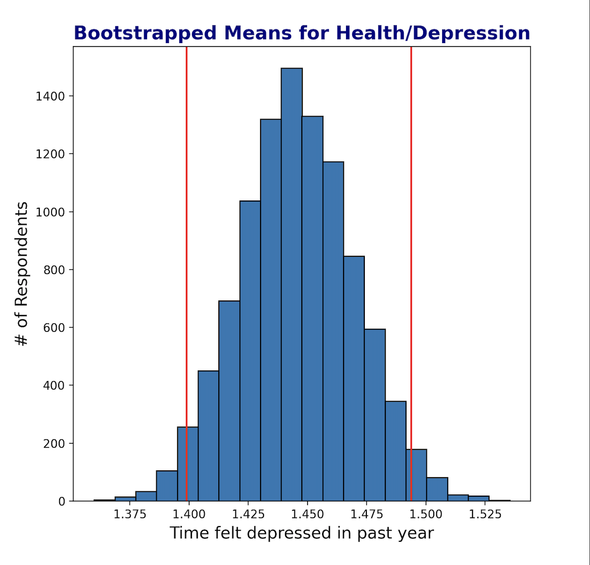

# An exploration of health and happiness data from the General Social Survey

## Capstone 1 for the Galvanize Data Science Immersive

### The GSS is one of the most influential studies in the social sciences.  The data collected in the survey includes demographic, financial, health, educational data and much more.   Something that makes this study so valuable is that it also includes respondents' opinions and beliefs on matters like government spending, the state of race relations, science, technology, and even philosophies about the nature of life.  For this project I set out to explore connections between overall health and other variables from the 2016 administration of the survey.

 

###  The graphs and correlation heatmap below represent the distrubution and correlations of data from a range of survey questions/answers.  For a question like, "How often do you feel happy?" respondents could choose answers like, *"Almost never, Sometimes, A lot of the time, or Almost all the time,"* and those answers were converted to a number scale.

 

______________________________________

### The purpose of this first capstone project was really just to perform some basic exploratory data analysis on a small set of data.  The GSS dataset has thousands of features and I didn't have much time to parse through them all to find the best variables to compare.  It was a challenging dataset to work with at this point in my data science studies but I didn't want something too easy.
 

### To present something reasonably valid in the short time I had available to complete this project, a simple hypothesis and set of three significantly correlated variables was chosen to compare from the 2016 survey:  Health, Time feeling happy, and Time feeling depressed.  
 

______________________________________
### **Hypotheses**

### Null:   Health **is not** related to feeling happy more often.
### Alternative:  Health **is** related to feeling happy more often.
______________________________________

 

 

______________________________________

### Using 95% confidence intervals, I found that bootstrapping with 10,000 iterations produced normal distributions for each variable and the means of the bootstrapped samples aligned with the means of the original samples.  This is a good indication that the sample data was representative of the population at the time the data was collected in 2016.
 

 

 

______________________________________

### Correlations between variables were also bootstrapped and results suggested that what was shown by the sample data is a reasonably reliable representation of the relationships between health, feeling happy, and feeling depressed for the population of the United States in 2016.  As a result we are able to reject the null hypothesis and confidently say that there is a strong relationship between overall health and the time a person feels happy.  

______________________________________
 
 

### In the future I'll revisit this important dataset with an expanded set of skills and the knowledge and time to pull out a larger, better set of variables.  The structure of this dataset did present some unique challenges at this point in my data science studies and I'm excited about returning to it to explore the insight it has to offer. I want uncover more about what the GSS has to say about the ways people change over time and the reasons behind those changes.

